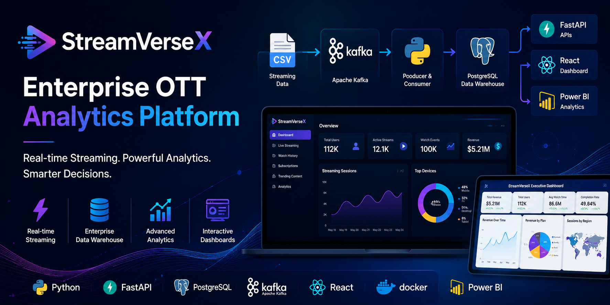
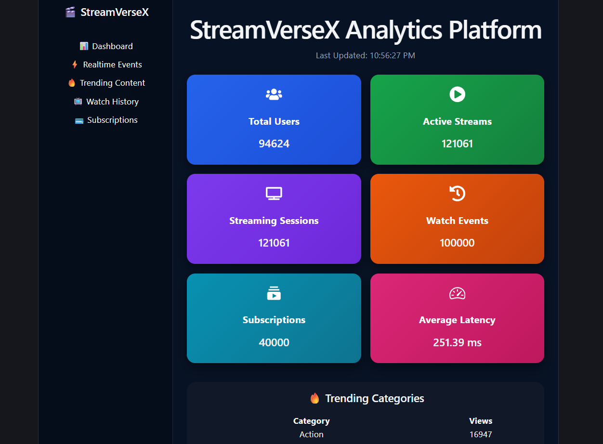
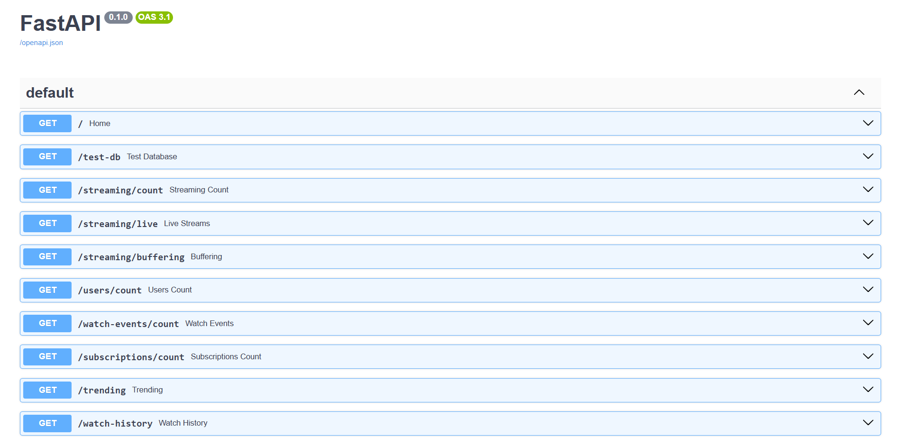
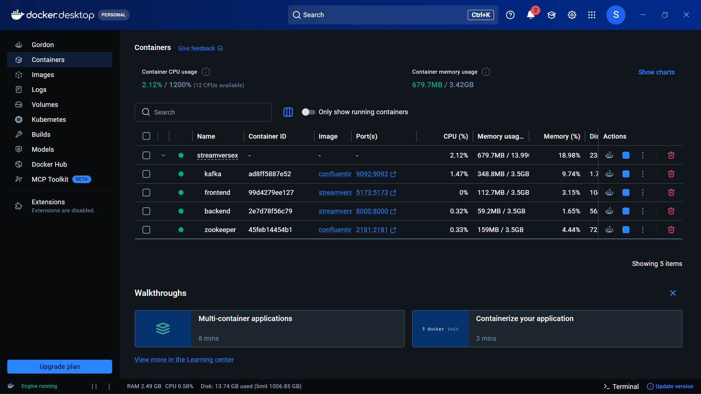
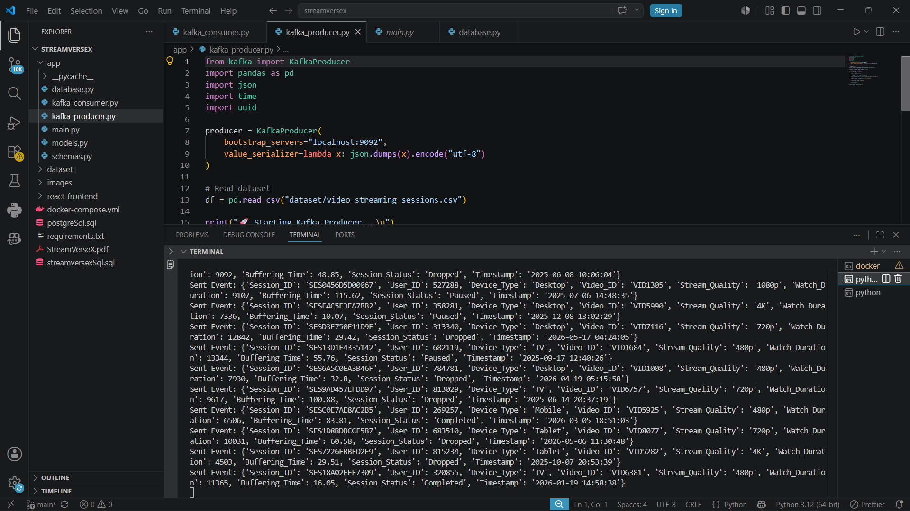
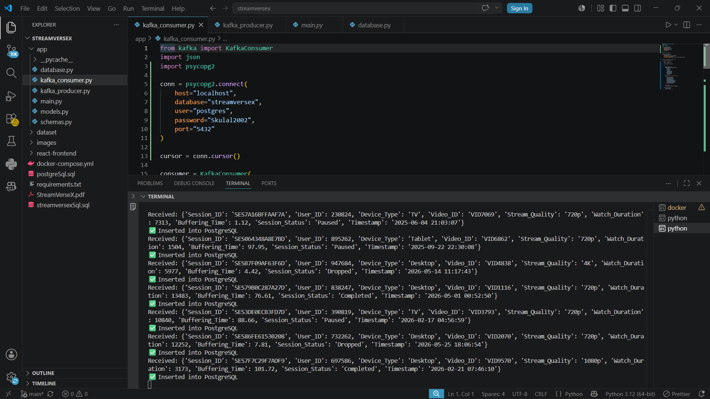
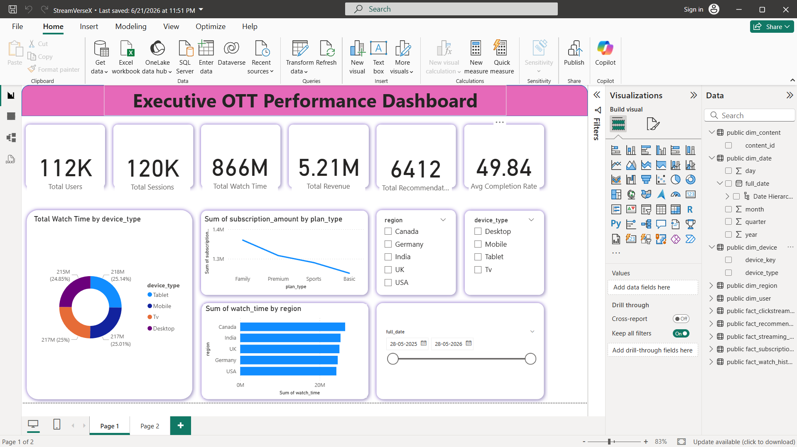
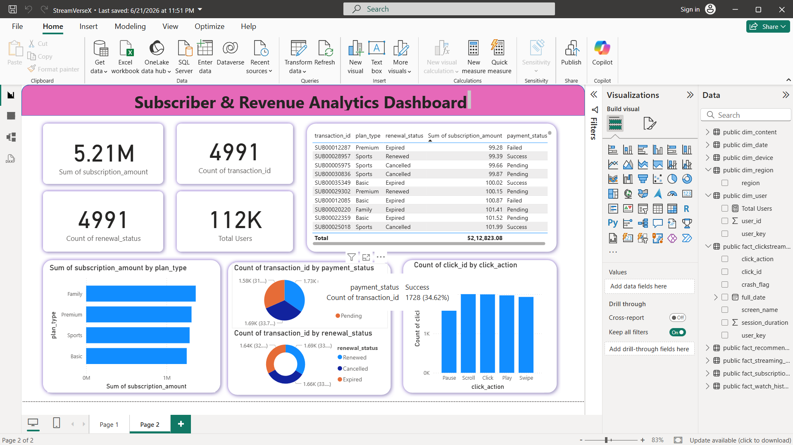
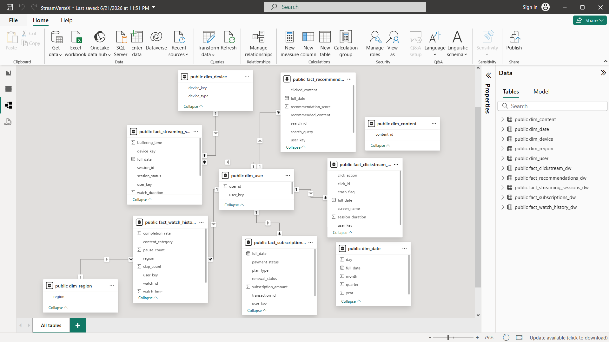

# 📺 StreamVerseX – Enterprise OTT Analytics Platform

<p align="center">
  
</p>

<p align="center">


</p>

---

# 🚀 About

**StreamVerseX** is an enterprise-level OTT Analytics Platform that simulates how modern streaming platforms such as **Netflix, Amazon Prime Video, Disney+ Hotstar, and JioHotstar** process, analyze, and visualize millions of streaming events.

The project demonstrates an end-to-end real-time analytics pipeline using **Apache Kafka**, **PostgreSQL**, **FastAPI**, **React**, **Power BI**, and **Docker**.

---

# 🎯 Problem Statement

Modern OTT platforms continuously generate massive volumes of streaming events, including:

- Video Streaming Sessions
- Watch History
- Subscription Transactions
- Buffering Logs
- User Clickstream
- Search Events
- Recommendation Events
- Content Metadata

Processing and analyzing these events requires scalable real-time data engineering solutions.

StreamVerseX demonstrates how such a platform can be built using modern open-source technologies.

---

# ✨ Features

- Real-Time Event Streaming using Apache Kafka
- Kafka Producer & Consumer
- Enterprise PostgreSQL Data Warehouse
- Star Schema Data Model
- FastAPI REST APIs
- Interactive React Dashboard
- Executive Power BI Dashboards
- Docker Containerization
- Synthetic OTT Dataset
- Business KPI Analytics

---

# 🏗️ Architecture

```text
                           StreamVerseX Architecture

         +----------------------+
         |  CSV Streaming Data  |
         +----------+-----------+
                    |
                    ▼
         +----------------------+
         |   Kafka Producer     |
         | (Python Producer)    |
         +----------+-----------+
                    |
                    ▼
         +----------------------+
         |    Apache Kafka      |
         | Topic: stream-events |
         +----------+-----------+
                    |
                    ▼
         +----------------------+
         |   Kafka Consumer     |
         | (Python Consumer)    |
         +----------+-----------+
                    |
                    ▼
         +----------------------+
         | PostgreSQL Database  |
         | Data Warehouse       |
         +------+---------+-----+
                |         |
                |         |
                ▼         ▼
      +---------------+   +----------------+
      | FastAPI APIs  |   |    Power BI    |
      | REST Backend  |   | Dashboards     |
      +-------+-------+   +----------------+
              |
              ▼
      +--------------------+
      | React Dashboard    |
      | Live Analytics     |
      +--------------------+
```

---

# ⚙️ Technology Stack

| Layer | Technology |
|--------|------------|
| Programming Language | Python |
| Backend API | FastAPI |
| Frontend | React + Vite |
| Database | PostgreSQL 17 |
| Real-Time Streaming | Apache Kafka |
| Data Processing | Pandas |
| Business Intelligence | Power BI |
| Containerization | Docker |

---

# 📂 Project Structure

```text
StreamVerseX
│
├── app/
│   ├── main.py
│   ├── kafka_producer.py
│   ├── kafka_consumer.py
│   ├── database.py
│   ├── models.py
│   └── schemas.py
│
├── dataset/
│
├── react-frontend/
│
├── images/
│   ├── banner.png
│   ├── architecture.png
│   ├── reactFrontend.png
│   ├── docker.png
│   ├── kafkaProducer.png
│   ├── kafkaConsumer.png
│   ├── fastAPI.png
│   ├── dashPage1.png
│   ├── dashPage2.png
│   └── dataModeling.png
│
├── docker-compose.yml
├── PostgreSql.sql
├── streamversexSql.sql
├── requirements.txt
└── README.md
```

---

# 📊 Dataset

The project uses synthetic OTT datasets including:

- Streaming Sessions
- Watch History
- Subscription Transactions
- Buffering Logs
- Clickstream Events
- Search Recommendation Logs
- Content Metadata

---

# 🔄 Data Flow

```text
CSV Dataset
      │
      ▼
Kafka Producer
      │
      ▼
Apache Kafka
      │
      ▼
Kafka Consumer
      │
      ▼
PostgreSQL Data Warehouse
      │
 ┌────┴─────────────┐
 ▼                  ▼
FastAPI         Power BI
 │
 ▼
React Dashboard
```

---

# 📡 REST APIs

| Endpoint | Description |
|-----------|-------------|
| / | Home |
| /docs | Swagger Documentation |
| /streaming/count | Streaming Sessions Count |
| /streaming/live | Active Streaming Sessions |
| /streaming/buffering | Buffering Analytics |
| /users/count | User Count |
| /watch-events/count | Watch Events Count |
| /subscriptions/count | Subscription Analytics |
| /trending | Trending Content |
| /watch-history | Watch History Analytics |

---

# 🐳 Docker

Run the complete application

```bash
docker compose up --build
```

---

# 📷 Project Screenshots

## React Dashboard



---

## FastAPI Swagger



---

## Docker Containers



---

## Kafka Producer



---

## Kafka Consumer



---

## Executive Power BI Dashboard



---

## Revenue Analytics Dashboard



---

## Star Schema Data Model



---

# 📈 Business KPIs

- Total Users
- Active Streaming Sessions
- Watch Events
- Subscription Revenue
- Watch Time
- Average Buffering Time
- Device Analytics
- Region Analytics
- Trending Content

---

# 🚀 Future Enhancements

- Apache Spark Streaming
- Kubernetes Deployment
- CI/CD with GitHub Actions
- AWS Cloud Deployment
- Recommendation Engine using Machine Learning
- Authentication & Authorization
- Role-Based Access Control

---

# 👨‍💻 Author

## Suraj K S

Information Science & Engineering

Aspiring Data Scientist | Data Analyst | Gen AI Developer | ML Enthusiast | Building Intelligent Solutions with Data

GitHub: https://github.com/surajks25

LinkedIn: https://www.linkedin.com/in/surajks25/

---

# ⭐ Support

If you found this project useful, consider giving it a ⭐ on GitHub.

It motivates me to build more enterprise-level data engineering and analytics projects.
