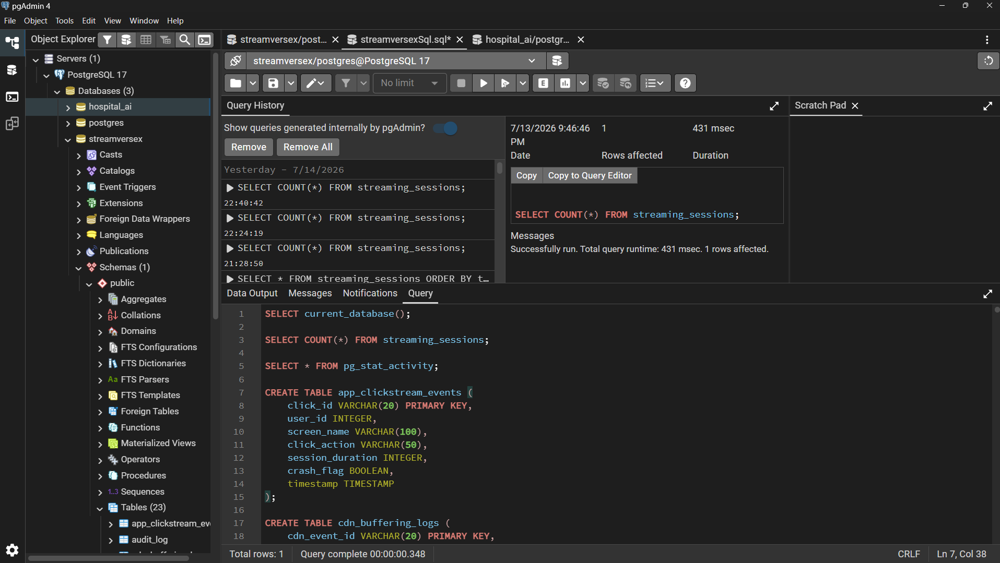

# 📺 StreamVerseX – Enterprise OTT Analytics Platform

<p align="center">
  
</p>

<p align="center">


</p>

---

# 🚀 About

**StreamVerseX** is an enterprise-level OTT Analytics Platform that simulates how modern streaming platforms such as **Netflix, Amazon Prime Video, Disney+ Hotstar, and JioHotstar** process, analyze, and visualize millions of streaming events.

The project demonstrates an end-to-end real-time analytics pipeline using **Apache Kafka**, **PostgreSQL**, **FastAPI**, **React**, **Power BI**, and **Docker**.

---

# 🎯 Problem Statement

Modern OTT platforms continuously generate millions of streaming events every day, including:

- Video Streaming Sessions
- Watch History
- Subscription Transactions
- CDN Buffering Logs
- User Clickstream
- Search Events
- Recommendation Events
- Content Metadata

Processing these massive datasets requires scalable real-time data engineering pipelines capable of ingestion, storage, processing, and visualization.

StreamVerseX demonstrates how this can be achieved using modern open-source technologies.

---

# ✨ Features

- Real-Time Event Streaming with Apache Kafka
- Kafka Producer & Consumer Pipeline
- PostgreSQL Enterprise Data Warehouse
- Star Schema Data Modeling
- FastAPI REST APIs
- Interactive React Dashboard
- Executive Power BI Dashboards
- Docker Containerization
- Synthetic OTT Dataset
- Business KPI Analytics

---

# 🏗️ System Architecture

<p align="center">

</p>

---

# 🔄 Data Flow

```text
CSV Dataset
      │
      ▼
Kafka Producer
      │
      ▼
Apache Kafka (Topic: stream-events)
      │
      ▼
Kafka Consumer
      │
      ▼
PostgreSQL Data Warehouse
      │
 ┌────┴─────────────┐
 ▼                  ▼
FastAPI APIs     Power BI
 │
 ▼
React Dashboard
```

---

# ⚙️ Technology Stack

| Layer | Technology |
|--------|------------|
| Programming Language | Python |
| Backend API | FastAPI |
| Frontend | React + Vite |
| Database | PostgreSQL 17 |
| Streaming | Apache Kafka |
| Data Processing | Pandas |
| Business Intelligence | Power BI |
| Containerization | Docker |

---

# 📂 Project Structure

```text
StreamVerseX
│
├── app/
│   ├── main.py
│   ├── kafka_producer.py
│   ├── kafka_consumer.py
│   ├── database.py
│   ├── models.py
│   └── schemas.py
│
├── dataset/
│
├── react-frontend/
│
├── images/
│   ├── bannerImage.png
│   ├── architecture.png
│   ├── reactFrontend.png
│   ├── docker.png
│   ├── kafkaProducer.png
│   ├── kafkaConsumer.png
│   ├── postgreSql.png
│   ├── fastAPI.png
│   ├── dashPage1.png
│   ├── dashPage2.png
│   └── dataModeling.png
│
├── docker-compose.yml
├── PostgreSql.sql
├── streamversexSql.sql
├── requirements.txt
└── README.md
```

---

# 📊 Dataset

The project uses synthetic OTT datasets including:

- Streaming Sessions
- Watch History
- Subscription Transactions
- CDN Buffering Logs
- Clickstream Events
- Search Recommendation Logs
- Content Metadata

---

# 📡 REST APIs

| Endpoint | Description |
|-----------|-------------|
| / | Home |
| /docs | Swagger Documentation |
| /streaming/count | Streaming Sessions Count |
| /streaming/live | Live Streaming Sessions |
| /streaming/buffering | Buffering Analytics |
| /users/count | Total Users |
| /watch-events/count | Watch Events |
| /subscriptions/count | Subscription Analytics |
| /trending | Trending Content |
| /watch-history | Watch History |

---

# 🐳 Docker

Run the entire project using Docker.

```bash
docker compose up --build
```

---

# 📷 Project Screenshots

## React Dashboard


---

## FastAPI Swagger


---

## Docker Containers


---

## Kafka Producer


---

## Kafka Consumer


---

## PostgreSQL Database

The Kafka Consumer continuously inserts streaming events into the PostgreSQL Data Warehouse, enabling real-time analytics and powering both the FastAPI backend and Power BI dashboards.



---

## Executive Power BI Dashboard


---

## Revenue Analytics Dashboard


---

## Star Schema Data Model


---

# 📈 Business KPIs

- Total Users
- Active Streaming Sessions
- Watch Events
- Subscription Revenue
- Watch Time
- Average Buffering Time
- Device Analytics
- Region Analytics
- Trending Content

---

# 🚀 Future Enhancements

- Apache Spark Streaming
- Kubernetes Deployment
- GitHub Actions CI/CD
- AWS Cloud Deployment
- Machine Learning Recommendation Engine
- JWT Authentication
- Role-Based Access Control

---

# 👨‍💻 Author

## Suraj K S

**Information Science & Engineering**

Aspiring **Data Scientist | Data Analyst | Data Engineer | Gen AI Developer | Machine Learning Enthusiast**

### Connect with me

- GitHub: https://github.com/surajks25
- LinkedIn: https://www.linkedin.com/in/surajks25/

---

# ⭐ Support

If you found this project useful, please consider giving it a ⭐ on GitHub.

Your support motivates me to build more enterprise-level Data Engineering, Analytics, and AI projects.
